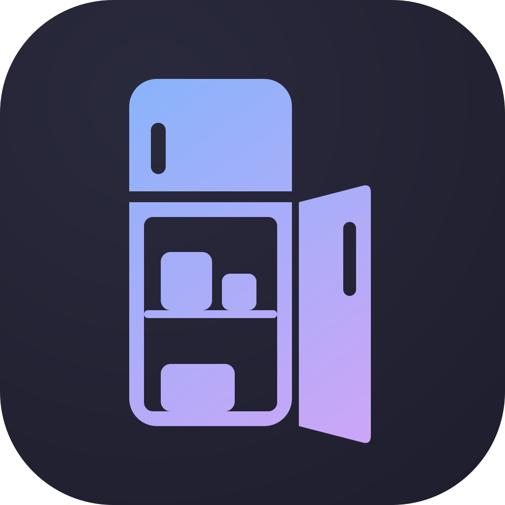
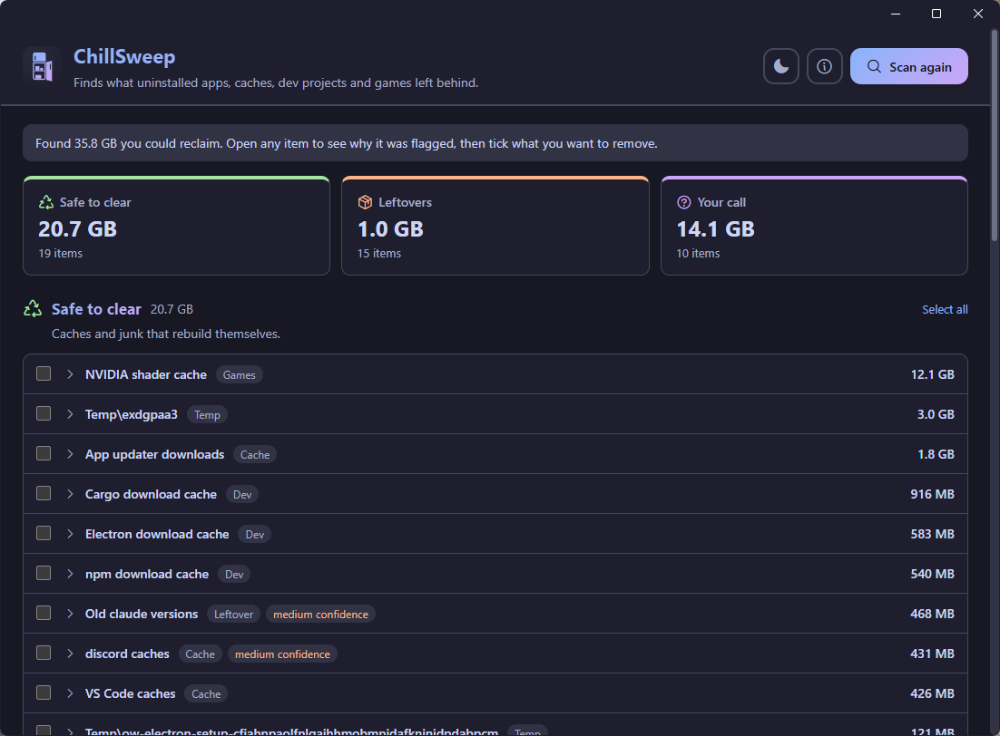

# ChillSweep

A cleanup app for Windows and macOS that finds what uninstalled apps, caches, dev projects and games left behind, and explains each item before you remove it.

**Download:**

- **Windows 10/11:** [ChillSweep-Setup.exe](https://github.com/terranivium/chillsweep/releases/latest/download/ChillSweep-Setup.exe). The installer isn't code-signed yet, so SmartScreen asks you to confirm on first run.
- **macOS 11 or later** (Apple silicon and Intel): [ChillSweep.dmg](https://github.com/terranivium/chillsweep/releases/latest/download/ChillSweep.dmg). Signed and notarized.

Each [release](https://github.com/terranivium/chillsweep/releases) lists its SHA-256 checksums and what's new.



Most cleaners work from a fixed list of junk locations. ChillSweep checks your user folders against what is actually installed: on Windows, the registry's installed programs and publishers, Start menu and desktop shortcuts, program files and Store apps; on macOS, app bundles, installer receipts and login items; and on both, running programs and Steam libraries. That lets it spot things like:

- app data from programs you've uninstalled ("Docker Desktop isn't installed")
- config files pointing at folders that no longer exist ("environments.txt points to C:\…\miniconda3, which no longer exists")
- old versions an app kept after updating itself
- caches that rebuild themselves (shader caches, npm/pip/Cargo/Electron caches, app updater downloads)
- build output and dependencies that git ignores in your projects
- empty Steam game folders, Workshop data and shader caches for uninstalled games
- save data for games that aren't installed (flagged as "your call", never as junk)
- big old videos, installers and archives in Downloads

Every finding lands in a tier (**Safe to clear**, **Leftovers**, **Your call**) with plain-language evidence and what happens if you remove it. No AI model is involved at runtime: detection is general signals plus a small knowledge base (`src-tauri/rules/default.toml`).

## Safety

- Scanning only reads (files, plus the registry on Windows). It never launches other programs.
- Protected locations (`.ssh`, Documents, browser profiles, password managers, …) are never flagged by the general signals.
- Nothing is selected by default, and removal needs a confirmation.
- Only items from the last scan can be removed, and each is re-checked right before removal (still exists, not protected, not in use by a running program).
- A signal that can show you exactly what something is — a Pro Tools session file sitting beside the cache it wants to clear — may offer items inside a protected folder. Everything else is still refused there. A shorter list (keys, keychains, cloud sync, password managers, sandboxed app data) is refused no matter what.
- Project folders from creative tools and game engines are recognised by their project file, so they're never mistaken for junk. What's found about them is kept in its own Projects section, out of the main total. The parts the tool rebuilds by itself are marked safe to clear; whole projects that were never used, or not opened in over a year, are only ever offered as your call.
- Items go to the Recycle Bin with an Undo button on Windows, or to the Trash with a Show in Trash button on macOS. Only "Safe to clear" items can optionally be deleted permanently.
- Every removal is logged to `%LOCALAPPDATA%\ChillSweep\history.jsonl` on Windows, or `~/Library/Application Support/ChillSweep/history.jsonl` on macOS.
- The only thing ChillSweep fetches from the internet is its update check: on startup it reads `latest.json` from this repo's [releases](https://github.com/terranivium/chillsweep/releases). Updates are signed and only install when you choose to.

## Development

Requires Rust (MSVC toolchain), the Visual Studio C++ Build Tools, and Node.js 22+.

```sh
npm install
npm run tauri dev                                # run the app
cd src-tauri && cargo test --lib                 # unit tests
cd src-tauri && cargo run --example scan         # command-line scan (add -- --json for raw output)
npm run notices                                  # regenerate src/third-party-notices.txt after dependency changes
npm test                                         # release-pipeline tests
npm run build                                    # installer for this OS, versioned 1.{commit count}.0
npm run release                                  # build, sign and upload a draft release (see RELEASING.md)
```

User-facing changes get a bullet under `## Unreleased` in `CHANGELOG.md` as they're made; that becomes the release notes and the app's About → What's new.

Code layout:

- `src-tauri/src/inventory/`: what's installed (registry, shortcuts, processes, program files, Steam)
- `src-tauri/src/signals/`: one file per kind of clutter; each returns findings with evidence
- `src-tauri/src/clean.rs`: removal, undo and history
- `src-tauri/rules/windows.toml`, `src-tauri/rules/macos.toml`: protected paths and the knowledge base, one file per platform
- `src/`: the UI (plain HTML, CSS and JavaScript)
- `build-scripts/`: versioning, the release pipeline and the changelog bake

## License

ChillSweep is free software, licensed under the [GNU General Public License v3.0](LICENSE). The third-party components it bundles, and their licenses, are listed in [`src/third-party-notices.txt`](src/third-party-notices.txt).
